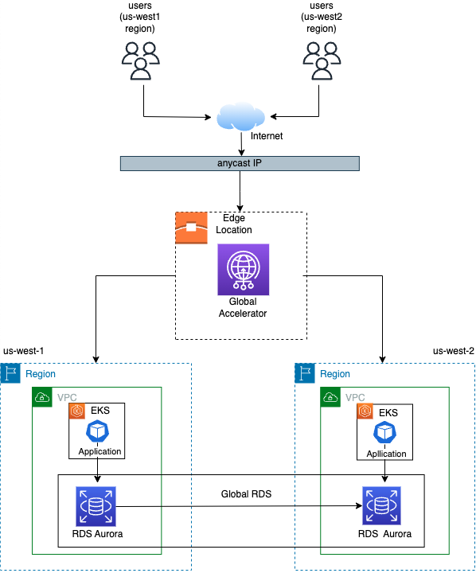

# Multi-Regional Cloud Infrastructure Setup

#### 
This readme file provides an overview of the multi-regional cloud infrastructure setup for a large online retail company using Amazon Web Services (AWS). The infrastructure is designed to ensure high availability, performance, and scalability for the company's website and mobile application, enabling customers to browse and purchase products from various regions around the world.

## Introduction

 This document outlines a multi-regional cloud infrastructure setup using AWS, aimed at achieving high availability, performance, and scalability for any online company's website and mobile application.
 To further enhance the global availability and performance of the company's services, AWS Global Accelerator can be utilized. This service provides static IP addresses and routes traffic across multiple AWS regions and application endpoints using anycast routing. By employing AWS Global Accelerator, the company can ensure low-latency, fault-tolerant, and highly available access to its applications from anywhere in the world.

## Project Structure
This project have main two folders 1. modules 2. environment Modules folder contains the multiple modules which have different usecases. Environment folder contain the root module which call all child modules to launch the resources.
There are some modules:

1. VPC module: In this module it created overall vpc structure like vpc, subnets, route table, security group, etc.

2. Global accelerator module: In this module global accelerator created , it contain two file 1. global_accelerator.tf all terraform code for created this and 2. variable.tf it contains all variables.

3. EKS module: In this module eks cluster is created , there are multiple files cluster.tf, roles.tf, policy.tf, security_group.tf, variables.tf and output.tf.

4. RDS module: In this module rds created , this module also needed multiple files for overall configuration of rds.

5. Global RDS module: In this module global rds created, it contains three files global_rds.tf, variable.tf and output.tf files.

6. K8s module: This module contains all kubernetes configurations.

This modules are main modules, there are more modules for overall setup.

## STEPS TO USE THE MODULE :

Clone the project
```
git@github.com:codexops/multi-regional-cloud-infra.git
```
Go to the project directory
```
cd /environments/prod
```
Initilize the terraform project
```
terraform init
```
Check plan
```
terraform plan
```
Run apply command to provision resources
```
terraform apply
```
To destroy the resources
```
terraform destroy
```

<div style="text-align:center">
  
</div>